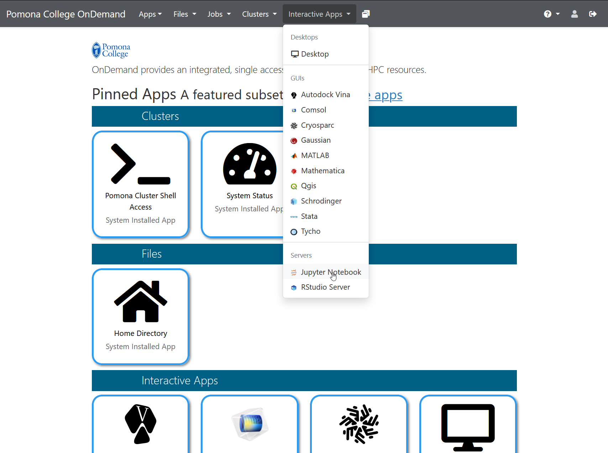
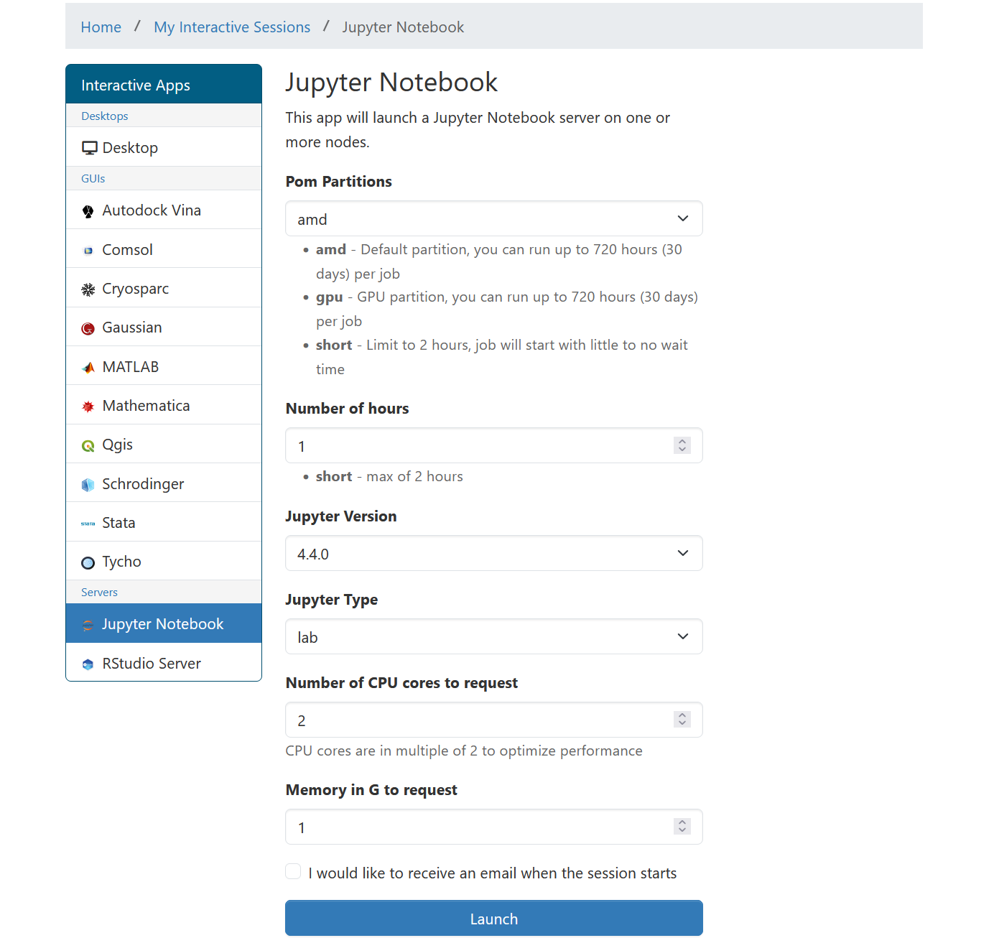

:::::::::::::::::::::::::::::::::::::: questions

- How do I launch Jupyter on the Sagehen cluster?
- What is the OnDemand portal and why use it?
- How do I request the right amount of compute resources?

::::::::::::::::::::::::::::::::::::::::::::::

::::::::::::::::::::::::::::::::::::: objectives

- Understand how the OnDemand portal works
- Successfully launch JupyterLab on Sagehen
- Request appropriate compute resources for your analysis

::::::::::::::::::::::::::::::::::::::::::::::

## The OnDemand Portal

**Open OnDemand** is a web-based interface for accessing HPC clusters. Instead of using SSH and command-line tools, OnDemand provides a graphical interface for:

- Viewing file systems on the cluster
- Launching interactive applications (like Jupyter)
- Monitoring jobs
- Managing files with a web-based file browser
- Terminal access (if needed)

Sagehen's OnDemand portal is at: **https://ondemand.hpc.pomona.edu/**

### Why OnDemand?

**Advantages:**
- **No installation needed** on your laptop, works with any web browser
- **No SSH required**, log in with your Pomona credentials
- **Web interface**, no command-line knowledge needed
- **DUO authentication**, secure access with your MFA device
- **Direct cluster access**, Jupyter runs on the cluster, not your laptop
- **Easy resource management**, request CPUs and RAM through simple forms

**When you launch Jupyter through OnDemand:**
1. OnDemand submits a SLURM job on your behalf
2. The job starts a JupyterLab server on a compute node
3. OnDemand creates a secure tunnel from your browser to that server
4. You see JupyterLab in your browser and can start working

All computation happens on the cluster, all results stay on the cluster (no network overhead).

## Step 1: Access OnDemand

1. Open a web browser (Chrome, Firefox, Safari, Edge)
2. Navigate to: **https://ondemand.hpc.pomona.edu/**
3. You'll see the Pomona College sign-in page
4. Enter your Pomona username and password
5. Complete DUO authentication (approve on your phone or enter a code)

{alt='Pomona College single sign-on login page showing username and password fields' width='600px'}

6. After authenticating, you'll see the OnDemand dashboard with your pinned apps

{alt='Pomona College OnDemand dashboard showing Interactive Apps sidebar with pinned applications' width='600px'}

## Step 2: Launch JupyterLab

Once logged into OnDemand:

1. In the top menu bar, click **"Interactive Apps"**
2. Select **"Jupyter Notebook"** from the dropdown menu

{alt='OnDemand Interactive Apps dropdown menu with Jupyter Notebook highlighted among other applications' width='600px'}

3. A form appears asking for resource requests

## Step 3: Request Resources

The form asks for several parameters. Here's what each means:

### Number of cores

How many CPU cores do you want? Default is 1, which is fine for learning and small datasets.

**Recommendations:**
- **1 core**: Development, testing, interactive work
- **2-4 cores**: Light data analysis, typical notebooks
- **8 cores**: Medium datasets, faster computation
- **16+ cores**: Large-scale analysis (rarely needed for notebooks)

For this workshop: **Use 1 core** to avoid using cluster resources others need.

### Memory (RAM)

How much RAM do you want? Specify in GB.

**Recommendations:**
- **2 GB**: Development, testing
- **4-8 GB**: Typical data analysis (default)
- **16-32 GB**: Large datasets (thousands of columns)
- **64+ GB**: Very large in-memory analysis

For this workshop: **Use 4 GB** (or the default).

### Wall time

How long should the job run before automatically stopping? Specify in hours.

**Common durations:**
- **1 hour**: Tutorials, learning
- **4 hours**: Interactive work, exploratory analysis
- **8 hours**: Long analysis sessions

**Important**: When your time limit is reached, the Jupyter server automatically stops. You can request a new session if you need more time. Your files are saved on the cluster, so no work is lost.

For this workshop: **Use 1 hour** (plenty of time for learning).

### Partition (optional)

Sagehen has different partitions (queues) for different job types:

- **amd** (default): Standard CPU partition, 128 cores, 500 GB RAM
- **gpu**: GPUs available (A100, L40S, RTX PRO 6000) for deep learning
- **short**: Max 2 hours, for quick jobs

For Jupyter notebooks: **Use the default (amd)** unless you're using GPUs.

::::::::::::::::::::::::::::::::::::: callout

### Workshop settings

For this workshop, use these values:

```
Number of cores: 1
Memory (GB): 4
Wall time (hours): 1
Partition: amd
```

Click **"Launch"** and wait. These are conservative settings that will start quickly and give us plenty of resources for learning.

::::::::::::::::::::::::::::::::::::::::::::::

The launch form lets you select partition, Jupyter version, number of hours, CPU cores, and memory:

{alt='OnDemand Jupyter Notebook launch form with fields for partition, Jupyter version, number of hours, CPU cores, and memory' width='500px'}

::::::::::::::::::::::::::::::::::::: challenge

## Challenge 1: Launch JupyterLab

1. Open https://ondemand.hpc.pomona.edu/ in your web browser
2. Log in with your Pomona credentials + DUO
3. Click "Interactive Apps" then "JupyterLab"
4. Fill in the form:
   - Number of cores: 1
   - Memory: 4 GB
   - Wall time: 1 hour
   - Partition: amd (default)
5. Click "Launch" and wait for the server to start

Once JupyterLab appears in your browser, you've successfully launched Jupyter on Sagehen! Leave it running for the next episode.

::::::::::::::: solution

## Solution

**Success indicators**: After clicking "Launch", you'll see a blue box showing "Your job is starting..." with SLURM job information. After 30 seconds to 2 minutes, this will redirect and you'll see the JupyterLab interface with:
- A left sidebar with file browser and launcher icons
- A main area (likely empty since you haven't opened anything yet)
- A top menu bar with File, Edit, View, Run, Kernel menus
- A kernel selector showing "Python 3" in the top right

**If this doesn't appear:**
- Wait up to 5 minutes (cluster might be busy)
- Check your internet connection
- Try again with fewer resources (fewer cores may start faster)
- Contact its-hpc@pomona.edu if stuck

:::::::::::::::::::::::::::

::::::::::::::::::::::::::::::::::::::::::::::

::::::::::::::::::::::::::::::::::::: keypoints

- OnDemand provides a web-based interface for launching Jupyter at https://ondemand.hpc.pomona.edu/
- Request compute resources (cores, memory, time) when launching
- Use conservative settings (1 core, 4 GB, 1 hour) for learning
- The amd partition is the default for standard CPU work

::::::::::::::::::::::::::::::::::::::::::::::
