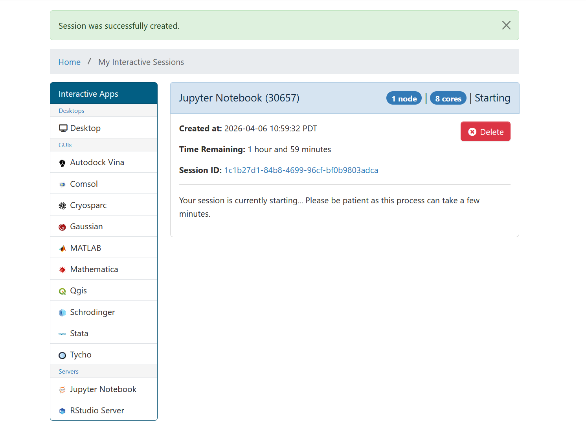
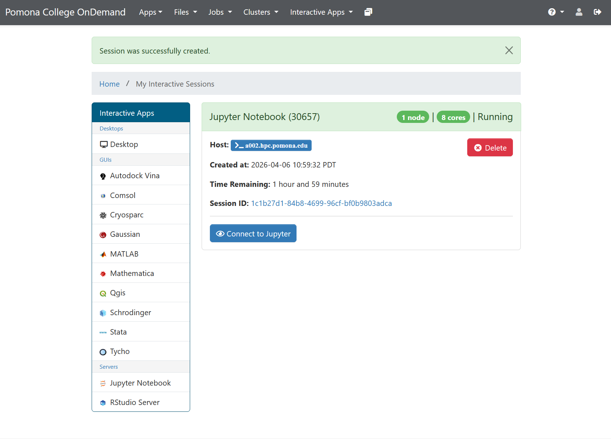
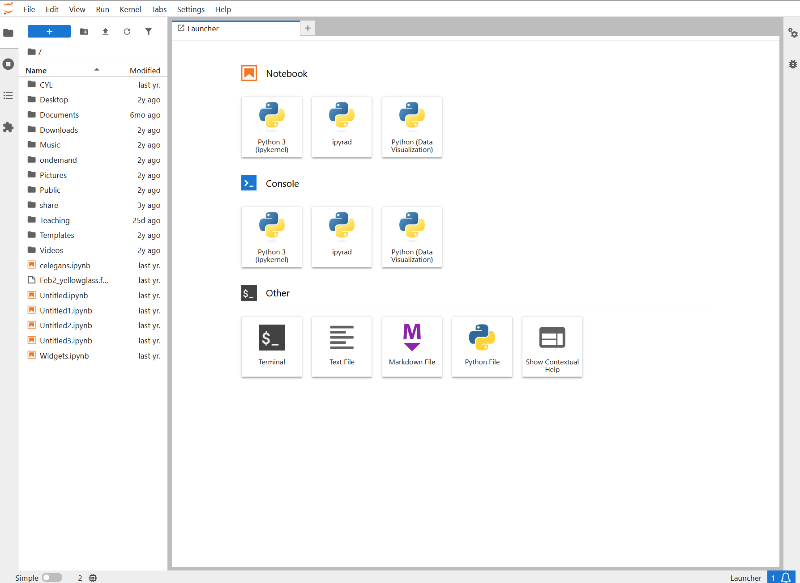
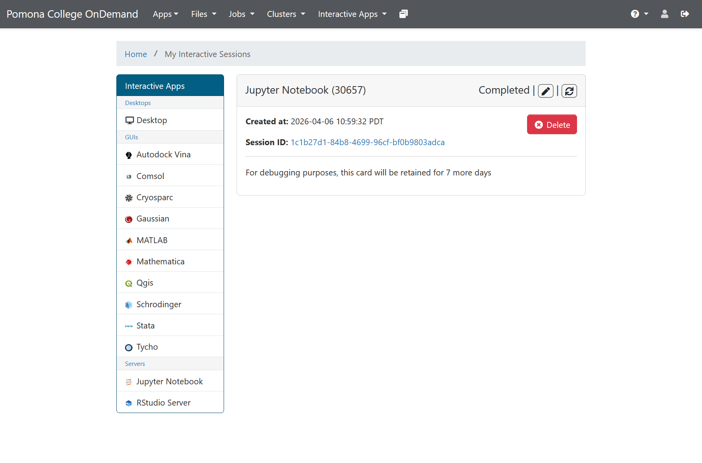

:::::::::::::::::::::::::::::::::::::: questions

- What does the JupyterLab interface look like?
- How do I create my first notebook?
- Where does my data live on Sagehen HPC?
- How do I stop my session when done?

::::::::::::::::::::::::::::::::::::::::::::::

::::::::::::::::::::::::::::::::::::: objectives

- Navigate the JupyterLab interface
- Create a new notebook and select a kernel
- Understand where data lives on Sagehen and how to access it
- Stop sessions properly to free cluster resources

::::::::::::::::::::::::::::::::::::::::::::::

## Waiting for the Server

OnDemand shows a card with your session status. First you'll see it in the "Starting" state:

{alt='OnDemand session card showing Jupyter Notebook job in Starting state with session details and time remaining' width='600px'}

Once the job is running, a green **"Connect to Jupyter"** button appears:

{alt='OnDemand session card showing Jupyter Notebook job in Running state with green Connect to Jupyter button' width='600px'}

Click **"Connect to Jupyter"** to open JupyterLab. This typically takes 30 seconds to 2 minutes from launch to connection.

### If it takes longer than 5 minutes

The cluster might be busy. You can:
- **Wait longer** (SLURM may take time to find resources)
- **Request fewer resources** (smaller jobs start faster)
- **Try later** (cluster load varies throughout the day)
- **Email its-hpc@pomona.edu** if it seems stuck

## The JupyterLab Interface

Once the server starts, you'll see the JupyterLab interface with the Launcher tab:

{alt='JupyterLab interface showing file browser on the left and Launcher tab with Notebook, Console, and Other sections including Python 3, ipyrad, and Python Data Visualization kernels' width='700px'}

The interface has:

- **Left sidebar**: File browser, running kernels, Git integration
- **Main area**: Launcher tab (or notebook/file editor once you open something)
- **Menu bar**: File, Edit, View, Run, Kernel menus
- **Right sidebar** (optional): Property inspector, Git, comments

JupyterLab is the modern interface for Jupyter. It's more powerful than the older "Notebook" interface, with better file browsing and tabbed editing.

## Creating Your First Notebook

1. In the left sidebar, look for "Notebook" under "Other"
2. Click the "+" button or right-click and select "New Notebook"
3. A dialog asks: "Select a kernel". Choose **"Python 3 (ipykernel)"**
4. A new notebook appears in the main area

Congratulations! You now have a blank notebook running on Sagehen.

## Understanding Data Storage

::::::::::::::::::::::::::::::::::::: callout

### Sagehen HPC storage paths

Your Jupyter session has access to all Sagehen storage:
- `/rhome/<myusername>`: Your home directory (100 GB, backed up)
- `/bigdata/lab/<labname>`: Lab shared storage (1 TB, backed up)
- `/scratch/your_username`: Fast temporary (SSD, not backed up)

Note: `/rhome` and `/bigdata` share a 1 TB lab quota.

::::::::::::::::::::::::::::::::::::::::::::::

In your first notebook cell, you can check your location:

```python
import os
print(os.getcwd())  # Probably /rhome/<myusername>
print(os.listdir('..'))  # See files in your home
```

You can load data from any of these locations:

```python
import pandas as pd
df = pd.read_csv('/bigdata/lab/<labname>/lab_data/experiments.csv')
# or
df = pd.read_csv(os.path.expanduser('~/data/file.csv'))
```

## Stopping Your Session

When you're done:

1. Save your notebook (Ctrl+S or File then Save)
2. Go back to the OnDemand dashboard
3. Find your running JupyterLab session
4. Click **"Delete"** to stop the server

This frees cluster resources for others. Your notebook file is automatically saved on Sagehen, so you can access it later.

After your session ends (or you delete it), the OnDemand card shows "Completed":

{alt='OnDemand session card showing Jupyter Notebook session in Completed state with message that the card will be retained for 7 more days' width='600px'}

::::::::::::::::::::::::::::::::::::: callout

### Don't forget to stop your session!

Even if you close your browser without clicking Delete, the session continues running (using cluster resources) until the wall time expires. Always delete your session when done so other users can access those resources.

::::::::::::::::::::::::::::::::::::::::::::::

## Connecting Again Later

Your notebooks are saved on Sagehen. To access them again:

1. Log into OnDemand again
2. Click "Interactive Apps" then "JupyterLab" again
3. The new JupyterLab session starts fresh, but your files are still there
4. Open any notebook from the file browser

::::::::::::::::::::::::::::::::::::: challenge

## Challenge 1: Explore the file system

In your running JupyterLab session:
1. Look at the left sidebar (the file browser)
2. Click on the folder icon to navigate
3. You should see your home directory
4. Create a new folder called `jupyter-workshop` (right-click then New Folder)
5. Click on the folder to open it
6. Create a new notebook: Click "+" then select "Notebook" then choose "Python 3"

This is your workspace for the rest of the workshop. Save this first notebook as `test.ipynb` in your workshop folder.

::::::::::::::: solution

## Solution

**Step-by-step completion:**
1. **File browser**: In the left sidebar, you'll see a folder icon at the top. Click it to reveal the file browser showing your current directory (usually `/rhome/<myusername>`).
2. **Create folder**: Right-click in the empty file browser area and select "New Folder". Type `jupyter-workshop` and press Enter.
3. **Navigate to folder**: Double-click the `jupyter-workshop` folder to open it. You should now see "jupyter-workshop" in the file path at the top.
4. **Create notebook**: In the file browser or main area, click the "+" button or use File then New then Notebook. When prompted, select "Python 3" or "Python 3 (ipykernel)" kernel.
5. **Save notebook**: A new untitled notebook appears in the main area. Click File then Save Notebook As (or use Ctrl+S). Name it `test.ipynb`. It will be saved in your jupyter-workshop folder.

**Verification**: You should see `test.ipynb` appear in the left file browser under jupyter-workshop, and the tab in the main area should show "test.ipynb" as the active notebook.

:::::::::::::::::::::::::::

::::::::::::::::::::::::::::::::::::::::::::::

::::::::::::::::::::::::::::::::::::: challenge

## Challenge 2: Access cluster data

In your notebook, create a code cell and run:

```python
import os

# Where am I?
print("Current directory:", os.getcwd())

# What can I see?
print("\nHome directory contents:")
print(os.listdir(os.path.expanduser("~")))

# Can I see /bigdata?
print("\n/bigdata contents:")
try:
    print(os.listdir("/bigdata"))
except PermissionError:
    print("No access to /bigdata (expected if not in a lab group)")
```

This verifies you can access the cluster's storage. The errors are normal if you're not in a lab group.

::::::::::::::: solution

## Solution

**Expected output** (varies by username and lab membership):

```
Current directory: /rhome/<myusername>

Home directory contents:
['Documents', 'Desktop', '.local', '.config', 'Downloads', ...]

/bigdata contents:
['lab1_data', 'lab2_data', ...]  # Or PermissionError if not in a lab
```

**What this demonstrates:**
- Your Jupyter kernel runs as your user (not root)
- You're currently in your home directory (`/rhome/<myusername>`)
- You have full read/write access to your home directory
- You can access /bigdata if you're in a lab group (if not, that's normal)

:::::::::::::::::::::::::::

::::::::::::::::::::::::::::::::::::::::::::::

::::::::::::::::::::::::::::::::::::: keypoints

- JupyterLab provides a modern interface with file browser, menus, and tabbed editing
- Create notebooks by clicking "+" and selecting a Python kernel
- Your Jupyter session has full access to Sagehen storage (/rhome, /bigdata, /scratch)
- Always stop your session when done to free cluster resources
- Your notebooks are saved on the cluster, accessible in future sessions

::::::::::::::::::::::::::::::::::::::::::::::

<!-- highlight <labname>/<myusername> placeholders in code blocks; remove if the varnish theme handles this natively -->
<script>(function(){var CSS='.sh-placeholder{color:#c2410c;font-weight:700}[data-bs-theme="dark"] .sh-placeholder,html.dark .sh-placeholder{color:#fdba74}@media (prefers-color-scheme: dark){[data-bs-theme="auto"] .sh-placeholder{color:#fdba74}}';var RX=/<labname>|<myusername>/g;function firstMatch(el){var w=document.createTreeWalker(el,NodeFilter.SHOW_TEXT,null),nodes=[],full='';while(w.nextNode()){nodes.push({n:w.currentNode,s:full.length});full+=w.currentNode.nodeValue;}RX.lastIndex=0;var m;while((m=RX.exec(full))){var s=m.index,e=s+m[0].length,inSpan=false,parts=[];for(var j=0;j<nodes.length;j++){var ns=nodes[j].s,ne=ns+nodes[j].n.nodeValue.length;if(ne<=s||ns>=e)continue;parts.push({node:nodes[j].n,a:Math.max(s-ns,0),b:Math.min(e-ns,nodes[j].n.nodeValue.length)});var p=nodes[j].n.parentNode;while(p&&p!==el){if(p.classList&&p.classList.contains('sh-placeholder')){inSpan=true;break;}p=p.parentNode;}}if(!inSpan&&parts.length)return parts;}return null;}function wrapParts(parts){for(var i=parts.length-1;i>=0;i--){var t=parts[i].node,txt=t.nodeValue,a=parts[i].a,b=parts[i].b;var span=document.createElement('span');span.className='sh-placeholder';span.textContent=txt.slice(a,b);var f=document.createDocumentFragment();if(a>0)f.appendChild(document.createTextNode(txt.slice(0,a)));f.appendChild(span);if(b<txt.length)f.appendChild(document.createTextNode(txt.slice(b)));t.parentNode.replaceChild(f,t);}}function run(){var st=document.createElement('style');st.textContent=CSS;document.head.appendChild(st);document.querySelectorAll('pre,code').forEach(function(el){var guard=0,parts;while((parts=firstMatch(el))&&guard++<500){wrapParts(parts);}});}if(document.readyState==='loading'){document.addEventListener('DOMContentLoaded',run);}else{run();}})();</script>
