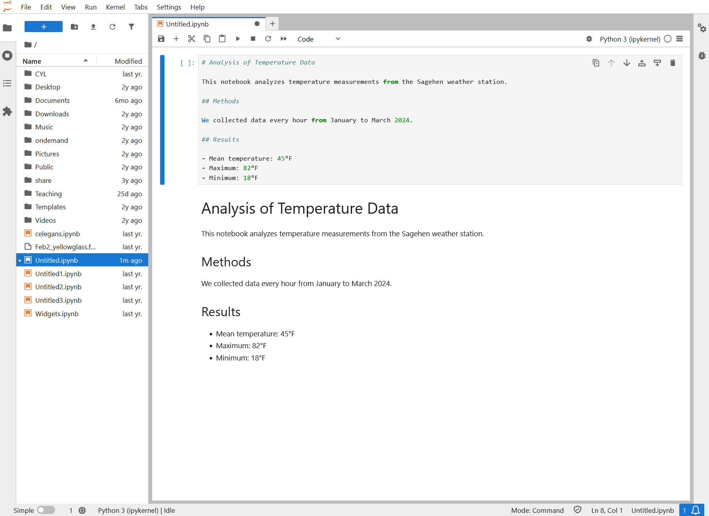
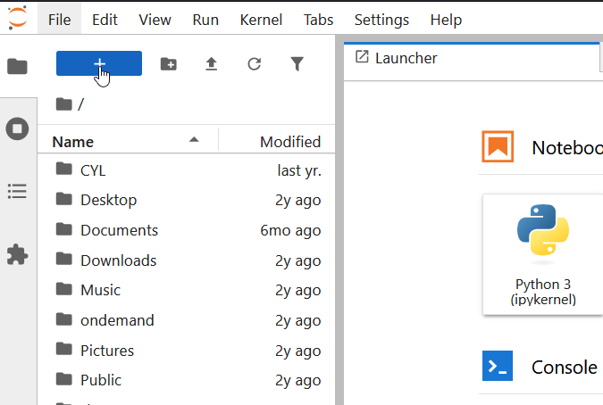
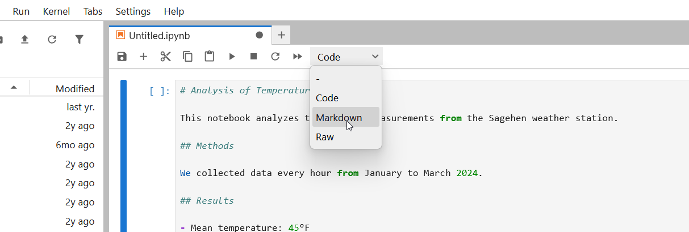
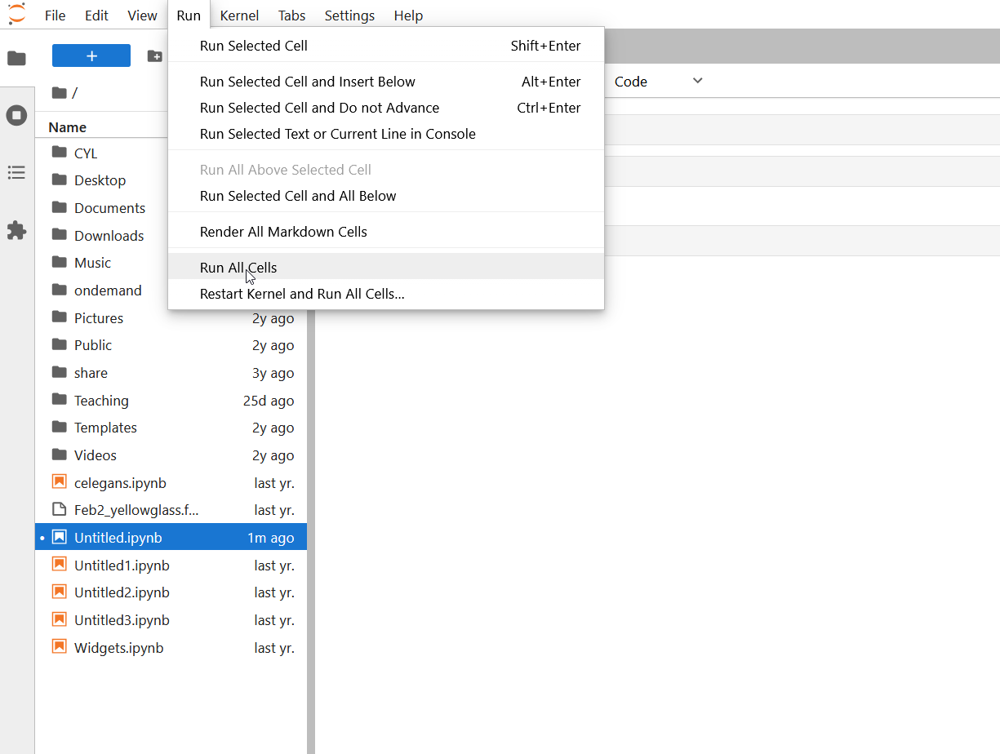

:::::::::::::::::::::::::::::::::::::: questions

- How do I create and edit cells in a notebook?
- What's the difference between code cells and markdown cells?
- How do I run cells and understand cell execution?
- Why does execution order matter?

::::::::::::::::::::::::::::::::::::::::::::::

::::::::::::::::::::::::::::::::::::: objectives

- Understand the two main cell types (code and markdown)
- Create, edit, and run cells in different ways
- Understand notebook state and execution order
- Use markdown to add rich formatting and documentation

::::::::::::::::::::::::::::::::::::::::::::::

{alt='A JupyterLab notebook. The upper cell holds markdown source with a heading, Methods and Results sections and a bullet list. Below it the same cell is shown rendered as formatted text, with Analysis of Temperature Data as a heading, a short paragraph, and bulleted mean, maximum and minimum values.'}

## Cell Types in Jupyter

A notebook is a sequence of **cells**. Each cell has a type that determines what happens when you run it.

{alt='JupyterLab interface with the file browser on the left showing home directory folders and the Launcher on the right with Python 3 ipykernel notebook option' width='600px'}

### Code cells

Code cells contain executable Python code. When you run a code cell:

1. The code is sent to the Python kernel (interpreter)
2. Python executes the code
3. Any output (print statements, plots, results) appears below the cell
4. The code has access to all variables from previously executed cells

Example code cell:

```python
# This is a code cell
x = 5
y = 10
print(f"x + y = {x + y}")
```

When run, this produces output:
```
x + y = 15
```

### Markdown cells

Markdown cells contain formatted text (not code). When you run a markdown cell, it displays as formatted text with headings, bold, italics, lists, links, images, and more.

```markdown
# Main Heading

## Subheading

This is **bold** and this is *italic*.

- Bullet point 1
- Bullet point 2

You can also write equations:
$$E = mc^2$$
```

## Creating Cells

### Creating a new cell

**Using the menu:**
1. Click the "+" button in the toolbar (or use menu: Insert then Insert Cell)
2. By default, new cells are code cells
3. To change to markdown, click the cell and use the dropdown (shows "Code" by default)

::::::::::::::::::::::::::::::::::::: callout

### Useful keyboard shortcuts

- **Ctrl+Shift+A**: Insert cell above current cell
- **Ctrl+Shift+B**: Insert cell below current cell
- **Escape** then **M**: Convert current cell to markdown
- **Escape** then **Y**: Convert current cell to code

::::::::::::::::::::::::::::::::::::::::::::::

### Choosing cell type

When you create a cell, it defaults to code. To change to markdown:

1. Click the cell you want to change
2. Look for a dropdown in the toolbar that says "Code"
3. Click it and select "Markdown" (or "Raw" for raw text)

{alt='JupyterLab toolbar cell type dropdown menu expanded showing dash, Code, Markdown, and Raw cell type options' width='500px'}

Or use the keyboard shortcut: press **Escape** then **M** (while the cell is selected)

## Running Cells

### Run a single cell

Click in a cell and press **Ctrl+Enter** (Windows/Linux) or **Cmd+Enter** (Mac).

The cell runs and the cursor stays in that cell.

### Run a cell and move to the next

Press **Shift+Enter** in a cell.

The cell runs and the cursor moves to the next cell (or creates one if you're at the end).

### Run all cells

In the menu, click **Run** then **Run All Cells**

{alt='JupyterLab Run menu expanded showing options including Run Selected Cell, Run All Cells, and Restart Kernel and Run All Cells with keyboard shortcuts' width='500px'}

This executes every cell in the notebook from top to bottom. Useful when you want to make sure everything works.

## Understanding Execution Order

A key concept: **Cells execute in the order you run them, not necessarily top-to-bottom.**

Example:

```
Cell 1:  x = 5
Cell 2:  print(x)      # If I run this first, I'll get an error!
Cell 3:  x = 10        # If I run this after Cell 2, x changes to 10
```

If you run Cell 2, then Cell 3, then Cell 2 again, you'll get different results.

### Cell numbers

Each code cell displays a number like `[1]`, `[2]`, etc., showing the **order in which it was run**, not its position in the notebook.

![Code cells showing execution numbers In[1], In[2], In[3] with variable assignments and print output](fig/14-code-cells-execution.png){alt='JupyterLab notebook showing three code cells with execution numbers: cell 1 sets x equals 5, cell 2 prints x showing output 5, cell 3 sets x equals 10' width='700px'}

::::::::::::::::::::::::::::::::::::: callout

### Best practice

Arrange cells logically (top-to-bottom) and run them in order. Don't jump around. When in doubt, restart the kernel and run all cells from the top to make sure everything works in sequence.

::::::::::::::::::::::::::::::::::::::::::::::

::::::::::::::::::::::::::::::::::::: challenge

## Challenge 1: Create a multi-cell notebook

In your running JupyterLab session:
1. Create a new notebook
2. In Cell 1 (code): Import libraries
   ```python
   import numpy as np
   import matplotlib.pyplot as plt
   ```
3. Press Shift+Enter (create new cell and move to it)
4. In Cell 2 (markdown): Add a title
   ```
   # My First Analysis

   This notebook demonstrates basic cell operations.
   ```
5. Run that markdown cell (Ctrl+Enter)
6. Create Cell 3 (code): Create data
   ```python
   x = np.linspace(0, 2*np.pi, 100)
   y = np.sin(x)
   ```
7. Create Cell 4 (code): Plot the data
   ```python
   plt.plot(x, y)
   plt.title('Sine Wave')
   plt.xlabel('x')
   plt.ylabel('sin(x)')
   plt.show()
   ```

Run all cells. You should see a plot appear below Cell 4.

::::::::::::::: solution

## Solution

**Expected notebook structure and behavior:**

```
[1] import numpy as np
    import matplotlib.pyplot as plt
    (Cell runs successfully with no output)

# My First Analysis
This notebook demonstrates basic cell operations.
(Displays as formatted heading and text)

[2] x = np.linspace(0, 2*np.pi, 100)
    y = np.sin(x)
    (Cell runs successfully with no output)

[3] plt.plot(x, y)
    plt.title('Sine Wave')
    plt.xlabel('x')
    plt.ylabel('sin(x)')
    plt.show()
    (Cell displays a smooth sine wave plot)
```

This demonstrates the power of notebooks: code, formatted text, and visualizations all in one document!

:::::::::::::::::::::::::::

::::::::::::::::::::::::::::::::::::::::::::::

::::::::::::::::::::::::::::::::::::: challenge

## Challenge 2: Test execution order

In the same notebook:
1. Create a new cell at the end:
   ```python
   print(f"x has {len(x)} points")
   print(f"y ranges from {y.min():.2f} to {y.max():.2f}")
   ```
2. Run this cell. It works because x and y were defined earlier.
3. Now, restart the kernel: Click **Kernel** then **Restart Kernel** then **Restart**
4. Try to run the last cell again without running the previous cells.
5. You'll get a `NameError` because x and y no longer exist.
6. Now, click **Run** then **Run All Cells** (to run from the beginning)
7. The error is fixed because all cells ran in order.

This demonstrates why execution order and kernel state matter!

::::::::::::::: solution

## Solution

**Before restarting**: Cell prints `x has 100 points` and `y ranges from -1.00 to 1.00`.

**After restarting, running only the last cell**: You see `NameError: name 'x' is not defined` because restarting the kernel clears all variables from memory.

**After Run All Cells**: Everything works again because Cell 1 defined numpy, Cell 3 created x and y, so the final cell can access them.

**Key lesson**: Cells depend on each other through kernel state (shared variables). Always run cells top-to-bottom or use "Run All Cells" to ensure dependencies are met.

:::::::::::::::::::::::::::

::::::::::::::::::::::::::::::::::::::::::::::

::::::::::::::::::::::::::::::::::::: keypoints

- Notebooks contain code cells (executable) and markdown cells (formatted text)
- Cells run in the order you execute them, not necessarily top-to-bottom
- The kernel maintains state (variables, imports) across cells
- Always arrange cells logically and run them in order
- Each cell should do one thing; keep cells focused and manageable

::::::::::::::::::::::::::::::::::::::::::::::
