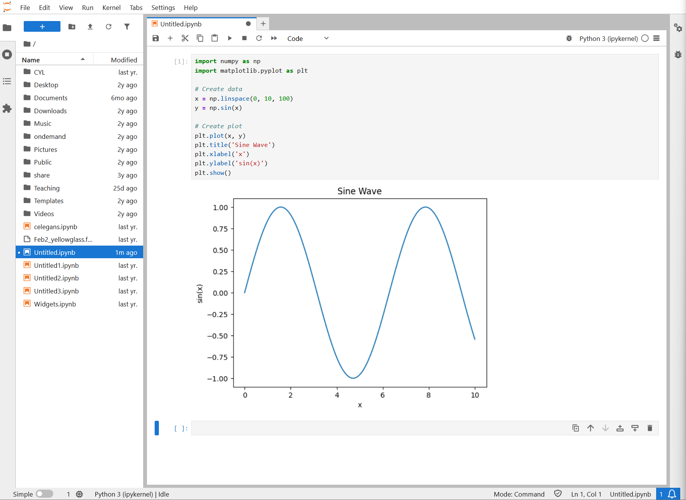

:::::::::::::::::::::::::::::::::::::: questions

- How do I create plots and visualizations in Jupyter?
- What types of plots are available with matplotlib?
- How do I create multi-panel figures with subplots?

::::::::::::::::::::::::::::::::::::::::::::::

::::::::::::::::::::::::::::::::::::: objectives

- Create line plots, scatter plots, histograms, and bar charts
- Customize plots with titles, labels, colors, and legends
- Create multi-panel figures using subplots
- Understand how inline plotting works in notebooks

::::::::::::::::::::::::::::::::::::::::::::::

## Inline Visualizations

Jupyter excels at inline visualizations. Plots appear right below code cells. Here's an example of a matplotlib sine wave plot rendered inline in a notebook:

{alt='JupyterLab notebook with Python code importing numpy and matplotlib, creating a sine wave plot that displays inline below the code cell' width='700px'}

## Line Plots

```python
import matplotlib.pyplot as plt
import numpy as np

x = np.linspace(0, 10, 100)
y = np.sin(x)

plt.figure(figsize=(10, 6))  # Width x Height in inches
plt.plot(x, y, label='sin(x)')
plt.plot(x, np.cos(x), label='cos(x)')
plt.xlabel('x')
plt.ylabel('y')
plt.title('Sine and Cosine')
plt.legend()
plt.grid(True)
plt.show()
```

## Scatter Plots

```python
import matplotlib.pyplot as plt
import numpy as np

# Generate random data
np.random.seed(42)
x = np.random.randn(100)
y = 2 * x + np.random.randn(100)

plt.scatter(x, y, alpha=0.6)
plt.xlabel('X')
plt.ylabel('Y')
plt.title('Scatter Plot')
plt.show()
```

## Histograms

```python
import matplotlib.pyplot as plt
import numpy as np

data = np.random.normal(100, 15, 1000)  # mean=100, std=15, 1000 samples

plt.hist(data, bins=30, edgecolor='black')
plt.xlabel('Value')
plt.ylabel('Frequency')
plt.title('Distribution')
plt.show()
```

## Bar Plots

```python
import matplotlib.pyplot as plt

categories = ['A', 'B', 'C', 'D']
values = [10, 24, 36, 15]

plt.bar(categories, values, color='steelblue')
plt.xlabel('Category')
plt.ylabel('Value')
plt.title('Bar Chart')
plt.show()
```

## Subplots

Create multi-panel figures for comparing visualizations:

```python
import matplotlib.pyplot as plt
import numpy as np

fig, axes = plt.subplots(2, 2, figsize=(12, 10))

x = np.linspace(0, 10, 100)

axes[0, 0].plot(x, np.sin(x))
axes[0, 0].set_title('Sine')

axes[0, 1].plot(x, np.cos(x))
axes[0, 1].set_title('Cosine')

axes[1, 0].plot(x, x**2)
axes[1, 0].set_title('Quadratic')

axes[1, 1].plot(x, np.exp(-x))
axes[1, 1].set_title('Exponential Decay')

plt.tight_layout()
plt.show()
```

::::::::::::::::::::::::::::::::::::: challenge

## Challenge 1: Create visualizations

Using the weather data (create it fresh if needed):

```python
import pandas as pd
import numpy as np

np.random.seed(42)
df = pd.DataFrame({
    'date': pd.date_range('2024-01-01', periods=100),
    'temperature': np.random.normal(65, 10, 100),
    'humidity': np.random.normal(60, 15, 100),
    'wind_speed': np.random.exponential(5, 100)
})
```

Create a figure with 3 subplots side by side:
1. A line plot of temperature over time
2. A scatter plot of temperature vs humidity
3. A histogram of wind speeds

Customize each plot with titles, labels, and colors.

::::::::::::::: solution

## Solution

```python
import matplotlib.pyplot as plt

fig, axes = plt.subplots(1, 3, figsize=(15, 4))

# Subplot 1: Line plot of temperature over time
axes[0].plot(df['date'], df['temperature'], color='red', linewidth=2)
axes[0].set_title('Temperature Over Time', fontsize=12, fontweight='bold')
axes[0].set_xlabel('Date')
axes[0].set_ylabel('Temperature (F)')
axes[0].grid(True, alpha=0.3)
axes[0].tick_params(axis='x', rotation=45)

# Subplot 2: Scatter plot of temperature vs humidity
axes[1].scatter(df['temperature'], df['humidity'], alpha=0.6, color='blue', s=50)
axes[1].set_title('Temperature vs Humidity', fontsize=12, fontweight='bold')
axes[1].set_xlabel('Temperature (F)')
axes[1].set_ylabel('Humidity (%)')
axes[1].grid(True, alpha=0.3)

# Subplot 3: Histogram of wind speeds
axes[2].hist(df['wind_speed'], bins=20, color='green', edgecolor='black', alpha=0.7)
axes[2].set_title('Distribution of Wind Speeds', fontsize=12, fontweight='bold')
axes[2].set_xlabel('Wind Speed')
axes[2].set_ylabel('Frequency')
axes[2].grid(True, alpha=0.3, axis='y')

plt.tight_layout()
plt.show()
```

**Key visualization techniques**:
- `figsize=(15, 4)` creates a wide figure suitable for 3 subplots
- `alpha=0.6` adds transparency so overlapping points are visible
- `grid=True` adds reference lines for easier reading
- `tight_layout()` prevents subplot overlap
- Each subplot has descriptive titles and axis labels

:::::::::::::::::::::::::::

::::::::::::::::::::::::::::::::::::::::::::::

::::::::::::::::::::::::::::::::::::: keypoints

- Jupyter displays matplotlib plots inline below code cells
- Line plots, scatter plots, histograms, and bar charts cover most visualization needs
- Use figsize to control plot dimensions and tight_layout() to prevent overlap
- Subplots let you compare multiple visualizations in a single figure
- Always add titles, axis labels, and legends for clarity

::::::::::::::::::::::::::::::::::::::::::::::
