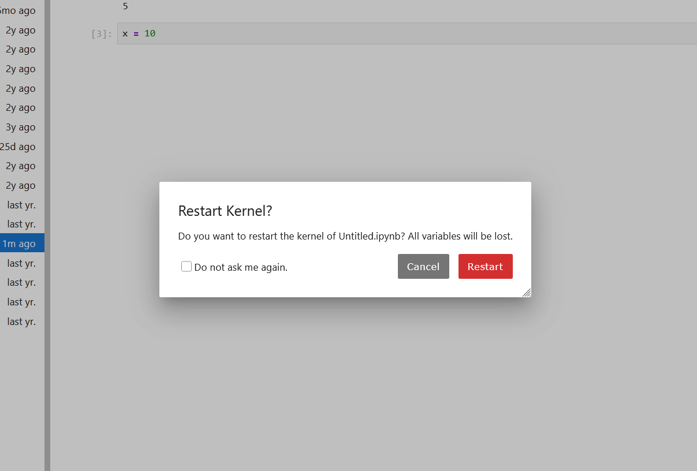
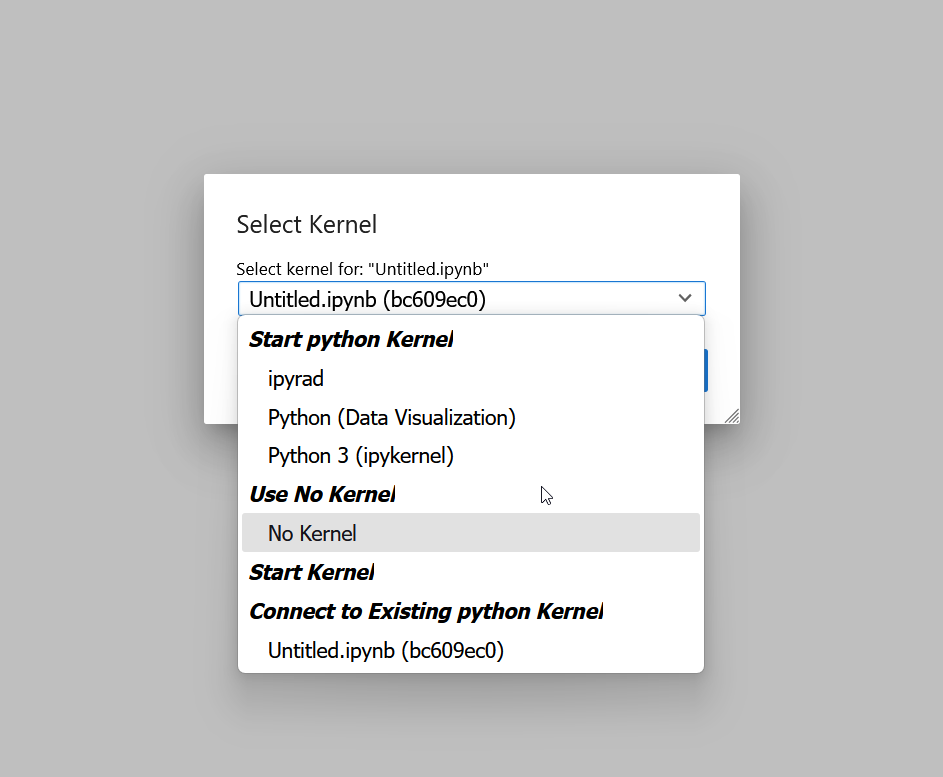
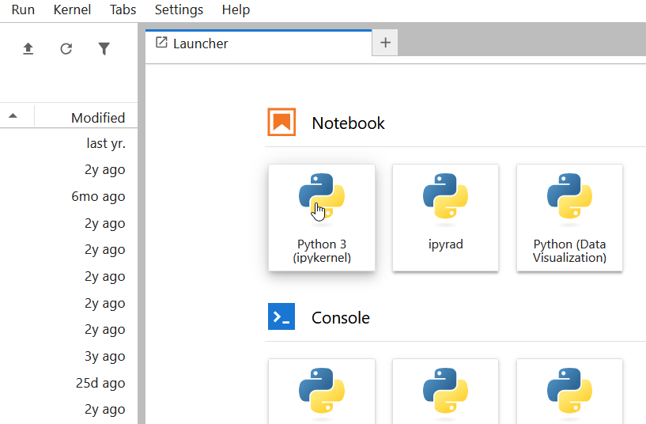

:::::::::::::::::::::::::::::::::::::: questions

- What is a kernel and how does it affect my notebook?
- How do I manage and restart kernels?
- What is a Python environment and why do I need one?
- How do I create a conda environment for my project?

::::::::::::::::::::::::::::::::::::::::::::::

::::::::::::::::::::::::::::::::::::: objectives

- Understand what the kernel is and how it maintains state
- Restart and manage kernels effectively
- Understand what Python environments are and why they matter
- Create and activate conda environments
- Install packages and register Jupyter kernels

::::::::::::::::::::::::::::::::::::::::::::::

## The Kernel: Python's Memory

The **kernel** is the Python interpreter running behind the scenes. It maintains:

- All variables you've created
- All imported libraries
- All function definitions
- All state from executed cells

When you run a code cell:
```python
name = "Alice"
age = 30
```

Those variables exist in the kernel's memory. In later cells, you can use them:

```python
print(f"{name} is {age} years old")  # This works!
```

## Restarting the Kernel

Sometimes you want to clear all variables and start fresh (e.g., to debug issues or verify your notebook works from scratch).

**To restart:**

1. Click **Kernel** then **Restart Kernel**
2. Or press the "restart" button in the toolbar
3. You'll see a confirmation dialog

{alt='JupyterLab Restart Kernel dialog asking Do you want to restart the kernel of Untitled.ipynb with Cancel and red Restart buttons' width='500px'}

4. Click "Restart"

After restarting, all variables are gone. If you run cells again, you're starting fresh.

::::::::::::::::::::::::::::::::::::: callout

### When to restart the kernel

- You want to verify your notebook works from the beginning
- You have mysterious errors that might be due to out-of-order execution
- You want to clear memory (e.g., if you loaded a huge dataset)
- You modified imported code and want to reload it

::::::::::::::::::::::::::::::::::::::::::::::

### Interrupting a long-running cell

If a cell is taking too long (stuck in an infinite loop or processing huge data):

1. Press the "stop" button in the toolbar
2. Or click **Kernel** then **Interrupt Kernel**
3. The cell stops executing

## What Are Python Environments?

A **Python environment** is an isolated installation of Python with a specific set of packages. Think of it as a container holding Python and libraries.

### Why environments matter

Imagine you have two projects:

- **Project A**: Needs numpy 1.20, matplotlib 3.3
- **Project B**: Needs numpy 1.25, matplotlib 3.8

If you install all packages in Python's default location, they conflict. Environments solve this by keeping packages isolated.

**Without environments:**
```
System Python
  numpy 1.25
  matplotlib 3.8
  pandas 2.0
  ... (all packages mixed together)
```

**With environments:**
```
Python installation
  project_a_env
    numpy 1.20
    matplotlib 3.3
    pandas 1.5

  project_b_env
    numpy 1.25
    matplotlib 3.8
    pandas 2.0
```

## Creating conda Environments

**conda** is Pomona's recommended tool for managing Python environments. On Sagehen, load conda first:

```bash
module load miniconda3
conda --version  # Verify it works
```

### Creating an environment

```bash
# Create environment with a name and Python version
conda create --name myproject python=3.11

# Or with initial packages
conda create --name myproject python=3.11 numpy pandas matplotlib
```

### Activating and using an environment

```bash
# Activate
conda activate myproject

# Install packages
conda install numpy scipy pandas

# Install with pip (if not available in conda)
pip install scikit-learn

# Deactivate when done
conda deactivate
```

### Listing environments

```bash
conda env list

# Output:
# base                     /opt/miniconda3
# myproject             *  /opt/miniconda3/envs/myproject
# (the * shows your current environment)
```

## Using Environments in Jupyter

To use a conda environment in Jupyter, you must install a kernel:

```bash
# Activate your environment
conda activate myproject

# Install jupyter and ipykernel
conda install jupyter ipykernel

# Install the kernel
python -m ipykernel install --user --name myproject --display-name "My Project (Python 3.11)"
```

### Selecting kernel in notebook

When you create a new notebook in JupyterLab:

1. Click "Select Kernel" when creating the notebook
2. Or click the kernel name in the top-right of JupyterLab
3. Choose your environment's kernel from the list

{alt='JupyterLab Select Kernel dialog showing available kernels including ipyrad, Python Data Visualization, and Python 3 ipykernel under Start python Kernel section' width='500px'}

On Sagehen, you'll see multiple kernels available in the Launcher:

{alt='JupyterLab Launcher showing three notebook kernel options: Python 3 ipykernel, ipyrad, and Python Data Visualization' width='500px'}

### Verifying your environment

In a notebook using your environment:

```python
import sys
print(sys.executable)  # Shows the Python in your environment
print(sys.version)     # Shows Python version

import numpy
print(numpy.__version__)  # Verify packages are installed
```

::::::::::::::::::::::::::::::::::::: challenge

## Challenge 1: Create a conda environment

1. Open a terminal (SSH to Sagehen or use OnDemand terminal):
2. Load conda and create an environment:
   ```bash
   module load miniconda3
   conda create --name workshop python=3.11 numpy pandas matplotlib jupyter ipykernel
   ```
3. Activate it and install the kernel:
   ```bash
   conda activate workshop
   python -m ipykernel install --user --name workshop --display-name "Workshop (Python 3.11)"
   ```
4. Verify with `conda list` (you should see numpy, pandas, matplotlib).

::::::::::::::: solution

## Solution

**Step 2 (create environment)**: conda asks `Proceed ([y]/n)?` -- type `y` and press Enter. It downloads and installs packages (takes 1-2 minutes).

**Step 3 (activate and install kernel)**: Your prompt changes to `(workshop) $`. Kernel install outputs:
```
Installed kernelspec workshop in /rhome/<myusername>/.local/share/jupyter/kernels/workshop
```

**Troubleshooting:**
- "conda: command not found" -- Try `module load anaconda3` or check with `module avail`
- Kernel doesn't appear in JupyterLab -- You may need to restart JupyterLab or refresh the page

:::::::::::::::::::::::::::

::::::::::::::::::::::::::::::::::::::::::::::

::::::::::::::::::::::::::::::::::::: challenge

## Challenge 2: Use environment in Jupyter

1. Launch JupyterLab through OnDemand
2. Create a new notebook and select the "Workshop (Python 3.11)" kernel
3. In the notebook, run:
   ```python
   import sys
   print(sys.executable)

   import numpy as np
   print(f"numpy version: {np.__version__}")

   import pandas as pd
   print(f"pandas version: {pd.__version__}")
   ```

Verify the Python executable path contains `envs/workshop`.

::::::::::::::: solution

## Solution

**Expected output:**
```
/opt/miniconda3/envs/workshop/bin/python
numpy version: 1.24.x
pandas version: 2.0.x
```

If `sys.executable` shows `/usr/bin/python` or `/opt/miniconda3/bin/python` (without `/envs/workshop`), you selected the wrong kernel. Go to the kernel selector (top-right of JupyterLab) and switch to "Workshop (Python 3.11)".

:::::::::::::::::::::::::::

::::::::::::::::::::::::::::::::::::::::::::::

::::::::::::::::::::::::::::::::::::: keypoints

- The kernel is the Python interpreter that maintains all variables and state
- Restart the kernel to clear state and verify notebooks work from scratch
- Interrupt the kernel to stop long-running cells
- Python environments isolate packages, preventing version conflicts
- conda is Pomona's recommended tool for managing environments
- Install kernels to use custom environments in Jupyter notebooks

::::::::::::::::::::::::::::::::::::::::::::::

<!-- highlight <labname>/<myusername> placeholders in code blocks; remove if the varnish theme handles this natively -->
<script>(function(){var CSS='.sh-placeholder{color:#c2410c;font-weight:700}[data-bs-theme="dark"] .sh-placeholder,html.dark .sh-placeholder{color:#fdba74}@media (prefers-color-scheme: dark){[data-bs-theme="auto"] .sh-placeholder{color:#fdba74}}';var RX=/<labname>|<myusername>/g;function firstMatch(el){var w=document.createTreeWalker(el,NodeFilter.SHOW_TEXT,null),nodes=[],full='';while(w.nextNode()){nodes.push({n:w.currentNode,s:full.length});full+=w.currentNode.nodeValue;}RX.lastIndex=0;var m;while((m=RX.exec(full))){var s=m.index,e=s+m[0].length,inSpan=false,parts=[];for(var j=0;j<nodes.length;j++){var ns=nodes[j].s,ne=ns+nodes[j].n.nodeValue.length;if(ne<=s||ns>=e)continue;parts.push({node:nodes[j].n,a:Math.max(s-ns,0),b:Math.min(e-ns,nodes[j].n.nodeValue.length)});var p=nodes[j].n.parentNode;while(p&&p!==el){if(p.classList&&p.classList.contains('sh-placeholder')){inSpan=true;break;}p=p.parentNode;}}if(!inSpan&&parts.length)return parts;}return null;}function wrapParts(parts){for(var i=parts.length-1;i>=0;i--){var t=parts[i].node,txt=t.nodeValue,a=parts[i].a,b=parts[i].b;var span=document.createElement('span');span.className='sh-placeholder';span.textContent=txt.slice(a,b);var f=document.createDocumentFragment();if(a>0)f.appendChild(document.createTextNode(txt.slice(0,a)));f.appendChild(span);if(b<txt.length)f.appendChild(document.createTextNode(txt.slice(b)));t.parentNode.replaceChild(f,t);}}function run(){var st=document.createElement('style');st.textContent=CSS;document.head.appendChild(st);document.querySelectorAll('pre,code').forEach(function(el){var guard=0,parts;while((parts=firstMatch(el))&&guard++<500){wrapParts(parts);}});}if(document.readyState==='loading'){document.addEventListener('DOMContentLoaded',run);}else{run();}})();</script>
