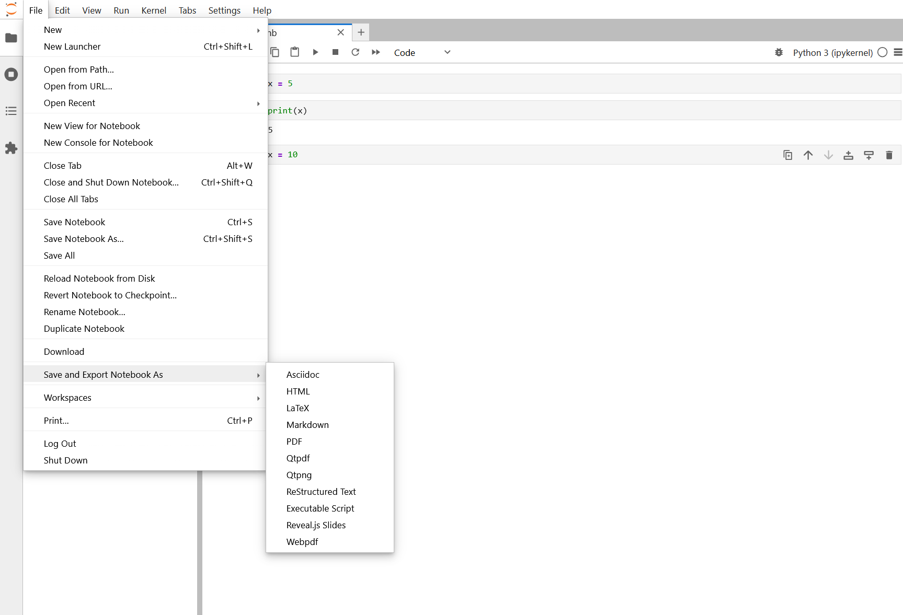

:::::::::::::::::::::::::::::::::::::: questions

- How can I convert notebooks to other formats?
- How do I use version control with notebooks?
- How do I share reproducible research?

::::::::::::::::::::::::::::::::::::::::::::::

::::::::::::::::::::::::::::::::::::: objectives

- Convert notebooks to Python scripts, HTML, and PDF
- Use version control (Git) with notebooks effectively
- Create reproducible environment files for sharing
- Publish and share reproducible research

::::::::::::::::::::::::::::::::::::::::::::::

## Converting Notebooks to Other Formats

### To Python script

Convert notebook to a standalone Python script:

```bash
# In terminal on Sagehen
jupyter nbconvert --to script my_notebook.ipynb

# Creates: my_notebook.py
# All code cells become code
# Markdown cells become comments
```

Then run the script:

```bash
python my_notebook.py
```

Or submit as a batch job:

```bash
sbatch --job-name=analysis --time=1:00:00 --cpus-per-task=4 --mem=8G script.sbatch
```

Where script.sbatch contains:
```bash
#!/bin/bash
module load miniconda3
conda activate analysis
python my_notebook.py
```

### To HTML (for sharing)

Create a self-contained HTML file that looks like the notebook:

```bash
jupyter nbconvert --to html my_notebook.ipynb

# Creates: my_notebook.html
# Open in any web browser - no Jupyter needed!
```

Email the HTML file to colleagues. They can view all code, outputs, and visualizations without having Jupyter installed.

### To PDF (for publication)

```bash
jupyter nbconvert --to pdf my_notebook.ipynb

# Creates: my_notebook.pdf
```

Note: PDF export requires additional dependencies. If it fails, convert to HTML first, then print to PDF from your browser.

### From JupyterLab interface

You can also export from within JupyterLab:

1. Click **File** then **Save and Export Notebook As**
2. Choose your desired format from the submenu

{alt='JupyterLab File menu expanded showing Save and Export Notebook As submenu with options including HTML, PDF, Executable Script, and more' width='500px'}

## Reproducible Environments

### Exporting an environment

Share your exact environment (all packages and versions) with colleagues:

```bash
conda activate myproject

# Export to a file
conda env export > environment.yml
```

The file looks like:

```yaml
name: myproject
channels:
  - conda-forge
  - defaults
dependencies:
  - python=3.11
  - numpy=1.24.0
  - pandas=2.0.0
  - matplotlib=3.7.0
  - pip
  - pip:
    - scikit-learn==1.3.0
    - requests==2.31.0
```

### Recreating from a file

Someone with this file can recreate your exact environment:

```bash
conda env create -f environment.yml
conda activate myproject
conda list
```

## Version Control with Git

### Including notebooks in Git

Notebooks are JSON files, so Git can track them, but diffs aren't pretty. Still include them:

```bash
# Initialize Git repo
git init

# Create .gitignore
cat > .gitignore << EOF
*.ipynb_checkpoints/
__pycache__/
*.pyc
data/raw/*
results/*
.DS_Store
EOF

# Add and commit
git add .
git commit -m "Initial notebook project structure"
```

### Best practices for Git + Notebooks

**Do commit:**
- Notebook files (yes, the .ipynb files)
- environment.yml (reproducibility!)
- README.md
- Small data files (< 10 MB)

**Don't commit:**
- Large datasets (use /bigdata or external storage)
- Output files (regenerate them)
- Checkpoint folders (.ipynb_checkpoints/)

**Before committing:**
1. Restart kernel
2. Run all cells
3. Clear large outputs: Edit then Clear Outputs of All Cells
4. Save notebook
5. Then commit

## Publishing Reproducible Research

### Sharing on GitHub

```bash
git init
git add .
git commit -m "Initial commit"
git remote add origin https://github.com/you/project.git
git push -u origin main
```

### Creating a DOI for citation

Use Zenodo to get a Digital Object Identifier (DOI):

1. Go to https://zenodo.org/
2. Login with GitHub
3. Authorize Zenodo to access your repos
4. Select your repo to archive
5. Get a citable DOI like: https://doi.org/10.5281/zenodo.xxxxx

::::::::::::::::::::::::::::::::::::: challenge

## Challenge 1: Export notebook in multiple formats

1. In JupyterLab, create a simple notebook with a markdown title and a code cell that creates a plot
2. Run all cells
3. Export to Python script:
   ```bash
   jupyter nbconvert --to script notebook_name.ipynb
   ```
4. Export to HTML:
   ```bash
   jupyter nbconvert --to html notebook_name.ipynb
   ```
5. Open the .py and .html files to see how they look

::::::::::::::: solution

## Solution

**Python script** output shows code cells as Python code and markdown as comments:
```python
# # Data Analysis Report
# This report demonstrates exporting notebooks.

import matplotlib.pyplot as plt
import numpy as np
# ... rest of code
```

**HTML output** creates a self-contained file viewable in any browser with formatted markdown, code cells, and embedded plots.

**Use cases:**
- **Script (.py)**: Run analysis on cluster with SLURM
- **HTML**: Email or share with colleagues who don't have Jupyter
- **PDF**: Submit with research reports or publish

:::::::::::::::::::::::::::

::::::::::::::::::::::::::::::::::::::::::::::

::::::::::::::::::::::::::::::::::::: challenge

## Challenge 2: Export environment file

1. In your terminal (while in the workshop environment):
   ```bash
   conda activate workshop
   conda env export > ~/workshop_environment.yml
   ```
2. Look at the file:
   ```bash
   cat ~/workshop_environment.yml
   ```
3. A collaborator can recreate your exact environment:
   ```bash
   conda env create -f workshop_environment.yml
   ```

This is how you ensure reproducibility across machines!

::::::::::::::: solution

## Solution

The file contains:
```yaml
name: workshop
channels:
  - conda-forge
  - defaults
dependencies:
  - python=3.11.x
  - numpy=1.24.x
  - pandas=2.0.x
  - ...
prefix: /opt/miniconda3/envs/workshop
```

A colleague can do `conda env create -f workshop_environment.yml` and `conda activate workshop` to get the exact same environment. This YAML file is the key to reproducible science.

:::::::::::::::::::::::::::

::::::::::::::::::::::::::::::::::::::::::::::

::::::::::::::::::::::::::::::::::::: keypoints

- Convert notebooks to Python scripts for batch jobs, HTML for sharing, PDF for publication
- Export environment.yml files so others can recreate your exact environment
- Use Git for version control; commit notebooks, environment.yml, and documentation
- Publish on GitHub and use Zenodo for citable DOIs
- Always restart kernel and run all cells before sharing

::::::::::::::::::::::::::::::::::::::::::::::
